# Contents

[Glossary](#glossary)

[Project Overview](#project-overview)

[What is Databricks?](#what-is-databricks)

[Architecture](#architecture)

[Streaming or Batch?](#streaming-or-batch)

[Data Consumption](#data-consumption)

[Steps](#steps)

[Step 1: Creating Layers](#step-1-creating-layers)

[Step 2: Loading the Bronze Layer](#step-2-loading-the-bronze-layer)

[Step 3: Cleaning Data and Saving to the Silver Layer](#step-3-cleaning-data-and-saving-to-the-silver-layer)

[Step 4: Saving Cleaned Data to the Gold Layer](#step-4-saving-cleaned-data-to-the-gold-layer)

[Step 5: Consuming Data in Power BI](#step-5-consuming-data-in-power-bi)

[Conclusion and Next Steps](#conclusion-and-next-steps)

# Glossary

| **Term**                      | **Definition**                                                                                                                                          |
|---------------------------------|--------------------------------------------------------------------------------------------------------------------------------------------------------|
| **ACID**                       | A set of rules ensuring that database operations are performed correctly and keep data consistent (Atomicity, Consistency, Isolation, Durability).     |
| **Apache Spark**               | A tool for processing large amounts of data quickly and distributed across multiple machines.                                                         |
| **Batch Processing**           | A method of processing large volumes of data at once rather than analyzing data as it arrives.                                                       |
| **Bronze Layer**               | The first data layer where raw data is stored without processing, as it arrives, before cleaning or transformation.                                   |
| **Data Lakehouse**             | A combination of a **Data Lake** (storing vast amounts of data) and a **Data Warehouse** (organizing data for analysis), offering the best of both.   |
| **Databricks**                 | A cloud-based platform that simplifies large-scale data processing using **Apache Spark**, also used for data science and analytics.                  |
| **Databricks Community Edition** | A free version of Databricks, ideal for testing and learning Spark and other tools without costs.                                                     |
| **dbfs**                       | Databricks File System, which organizes and stores data like a folder system on a computer, but in the cloud.                                        |
| **Delta Lake**                 | Technology that enhances data storage by ensuring data remains organized, secure, and correctly updated without errors.                               |
| **Gold Layer**                 | The final data layer, where data is fully processed and ready for use in reports and analysis.                                                        |
| **Landing Zone**               | The area where raw data is initially stored. It is the "first stop" for data before being organized.                                                  |
| **Medallion Architecture**     | A structure that organizes data into layers (bronze, silver, gold), with each layer having a specific processing and refinement level.               |
| **/mnt**                       | A directory in Databricks used to connect and access data stored in external services like Azure or AWS.                                              |
| **PySpark**                    | A version of Spark that works with Python, making Spark accessible to Python developers.                                                              |
| **Silver Layer**               | The second data layer, where data is cleaned and organized, ready for deeper analysis or reporting.                                                  |
| **Streaming Processing**       | A method for processing data in real-time, analyzing it as it arrives.                                                                               |
| **Unity Catalog**              | A Databricks tool for centralized data governance, organizing and controlling access to data efficiently.                                             |

# Project Overview

In the previous project, an income statement (DRE) was automated using Python and CSV files. With the increase in data volume, the pipeline was migrated to **Databricks Community Edition**, ensuring scalability, automation, and database integration. One of the main challenges of this project was translating the treatments previously done in pure Python into **PySpark**, a language I am not very familiar with, although it shares some similarities with Python. 

Alternatively, I could have opted for **SQL**, which I am more proficient in, but I chose PySpark to gain familiarity with the language.

Let’s break it down: later in this document, I will explain what Databricks is, its layers, why it was chosen, and the problems it addresses.

**How it works:**

1.  **Landing Zone**: Raw data, such as CSV files, is stored in this layer without any modifications.
2.  **Bronze Layer**: Data from the Landing Zone is transferred and stored in the Delta Lake format, ready for processing.
3.  **Silver Layer**: At this stage, the data is cleaned and transformed to ensure consistency and quality.
4.  **Gold Layer**: The refined and cleaned data is organized for reporting and analysis.
5.  **Power BI Consumption**: Power BI connects to Databricks via ODBC/JDBC, enabling direct consumption of the created tables.

# What is Databricks?

**Databricks** is a cloud-based platform that simplifies the processing and analysis of large-scale data quickly and efficiently. It combines the technology of **Apache Spark**—a powerful tool for large-scale data processing—with a collaborative environment where teams can develop, share, and automate data pipelines, as well as execute advanced analytics.

Databricks allows you to organize data into different "layers," ranging from raw data to fully processed data ready for dashboards and reports. It is widely used for **data science**, **data engineering**, and **data analytics** in real-time or large-scale scenarios.

Here are some key advantages of using Databricks:

-   **Scalability**: Handles large data volumes by distributing tasks across multiple machines.
-   **Collaboration**: Enables data teams to work together using shared notebooks.
-   **Automation**: Simplifies the creation of automated workflows to process and transform data.
-   **Flexibility**: Works with various data sources and integrates seamlessly with BI tools and databases.

# Architecture

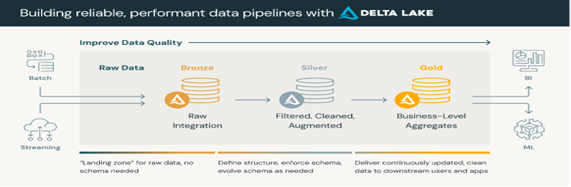

**The migration architecture for the income statement (DRE) project to Databricks follows a multi-hop concept using Delta Lake, divided into data processing layers: Landing Zone, Bronze, Silver, and Gold. Each layer has a specific role in processing and transforming the data, ensuring an efficient flow and high-quality data for analysis.**

1.  **Landing Zone**:
    -   **The Landing Zone is the entry point for raw data, where CSV files are directly uploaded. The data arrives in its original format without any transformation or cleaning. This ensures that the complete data history is preserved for future reprocessing or auditing.**

2.  **Bronze Layer**:
    -   **In the Bronze Layer, raw data from the Landing Zone is moved and stored in Delta Lake format. At this stage, the data is integrated and prepared for transformation processes. While still raw, it is organized in a more suitable format for subsequent processing.**

3.  **Silver Layer**:
    -   **In the Silver Layer, data is cleaned, transformed, and standardized. This stage involves filtering and correcting the data, removing inconsistencies, and adjusting data types. Here, tables are prepared for more detailed analyses, ensuring consistent and ready-to-use data.**

4.  **Gold Layer**:
    -   **The Gold Layer is where data is business-ready. Data is aggregated and refined to generate deeper insights and analyses in visualization tools like Power BI. At this layer, the data is highly optimized for fast and efficient queries.**

# Streaming or Batch?

**Data processing can follow two main approaches: batch and streaming. Each has specific advantages depending on the nature of the data and processing needs.**

**Batch Processing:**

**Batch involves collecting and processing large data volumes at defined intervals, such as daily, monthly, or as needed. This method is ideal when real-time analysis is unnecessary, and data can be grouped for later processing.**

-   **Application in the project:** For this DRE project, batch processing is the chosen method. Financial data is extracted at defined periods, such as monthly or quarterly closings, and does not require immediate responses. Batch processing consolidates this data periodically, ensuring efficient use of computational resources.
-   **Advantages:** Batch simplifies processing large data volumes at once, optimizing resource usage without requiring continuous processing.

**Streaming Processing:**

**Streaming involves processing data in real-time or near real-time as it arrives. This means the system can continuously respond to data changes, enabling immediate analysis.**

-   **Future Possibility:** While batch is the initial choice, the project may expand to include streaming in the future. If the company begins receiving financial data directly from a real-time database, streaming would allow immediate processing and analysis, facilitating instant decision-making.
-   **Advantages:** Streaming is ideal for scenarios requiring immediate responses, such as continuous monitoring or real-time financial transaction flows.

# Data Consumption

**In this project, Power BI remains the primary tool for data visualization and analysis. The only significant change was the data source. Previously, data was extracted from a local database, but now the data source is Databricks.**

**After processing and refining data in the Bronze, Silver, and Gold layers, it is connected to Power BI directly from Databricks. This ensures that the information used in reports and dashboards is always up to date, improving performance and scalability without relying on local databases.**

# Steps

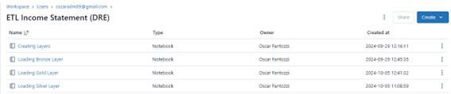

The project was divided into four main steps, following the flow of Databricks' **Bronze**, **Silver**, and **Gold** layers. First, the **layer structure** was created to organize data into different processing levels. Then, raw data was loaded from the **Landing Zone** to the **Bronze Layer** (raw data), followed by cleaning and transformation for the **Silver Layer** (organized data). Finally, data was optimized and aggregated in the **Gold Layer** for reporting and analysis. The process was modularized into separate notebooks, making each step easier to manage and execute independently.

## Step 1: Creating Layers

**This step involves creating the landing zone, bronze, silver, and gold layers.**

**Creating Landing Zone:**

\# creating landing zone

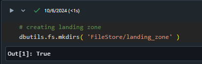

**Creating Bronze Layer:**

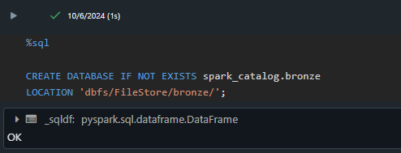

**Creating Silver Layer:**

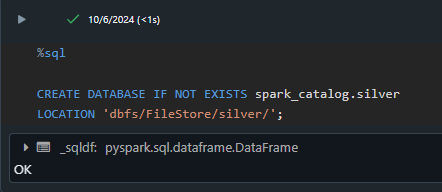

**Creating Gold Layer:**

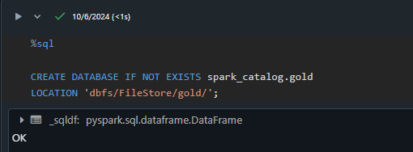

## Step 2: Loading the Bronze Layer

In this step, raw data from the Landing Zone is loaded into the Bronze Layer:

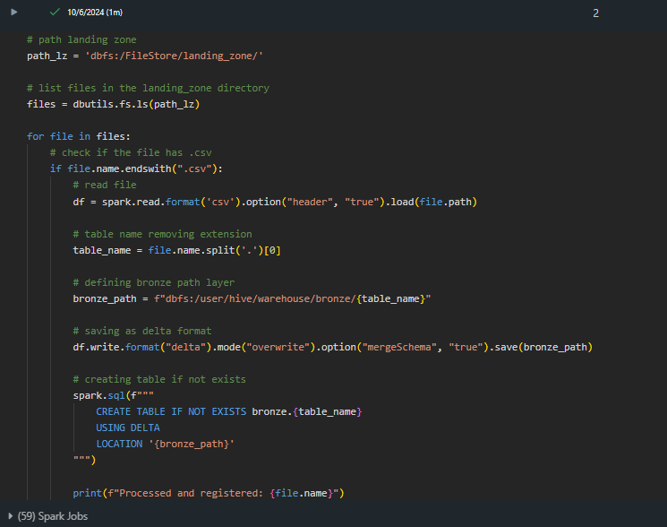

## Step 3: Cleaning Data and Saving to the Silver Layer

In this step, data from the Bronze Layer is cleaned and saved into the Silver Layer. The notebook can be accessed at this link: [Loading Silver Layer](https://databricks-prod-cloudfront.cloud.databricks.com/public/4027ec902e239c93eaaa8714f173bcfc/3888749691583407/84552440955705/6757744284100272/latest.html).

## Step 4: Saving Cleaned Data to the Gold Layer

In this step, cleaned data is moved to the Gold Layer, making it ready for consumption. The notebook can be accessed at this link: [Loading Gold Layer](https://databricks-prod-cloudfront.cloud.databricks.com/public/4027ec902e239c93eaaa8714f173bcfc/3888749691583407/4087602558815085/6757744284100272/latest.html).

## Step 5: Consuming Data in Power BI

Since I am using the Databricks Community Edition, which is not directly integrated with Azure (Power BI connector), I will connect using ODBC/JDBC. The first step is to install the ODBC driver from this link: [ODBC Driver](https://www.databricks.com/spark/odbc-drivers-download).

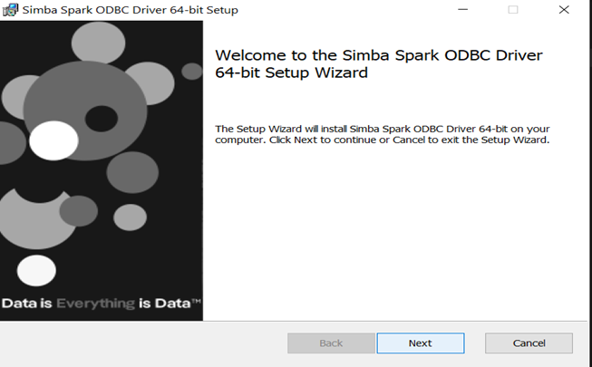

If everything is correctly set up, Databricks should appear among the connectors, as shown below:

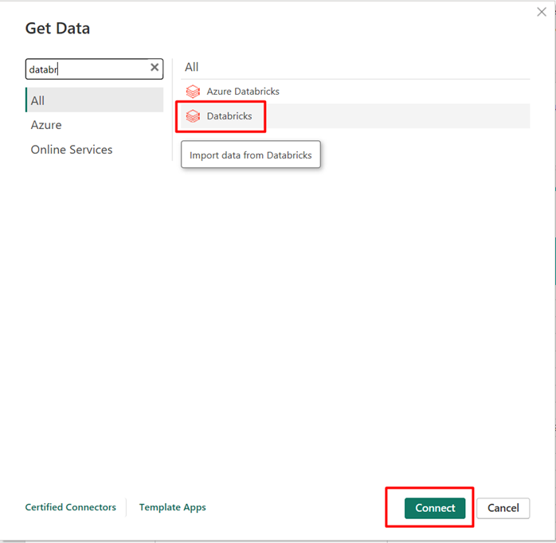

Click **Connect** and fill in the following fields:

**Server Hostname**

**HTTP Path**

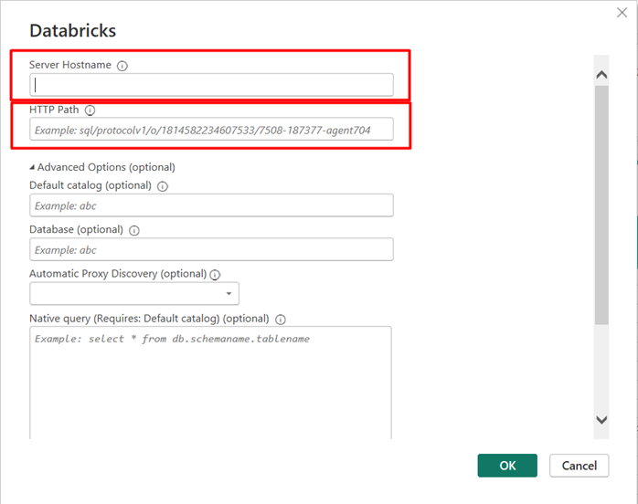

To obtain this information, navigate to the Compute section in Databricks:

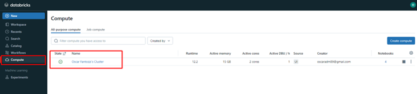

Click your active cluster, and under JDBC/ODBC, you will find the credentials:

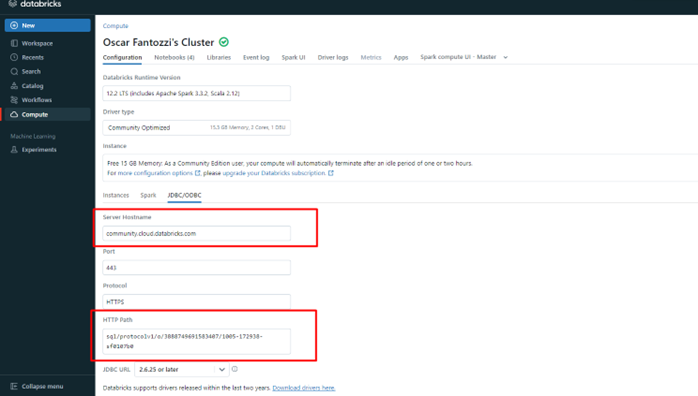

After copying and pasting the credentials, you can access the layers created in Databricks:

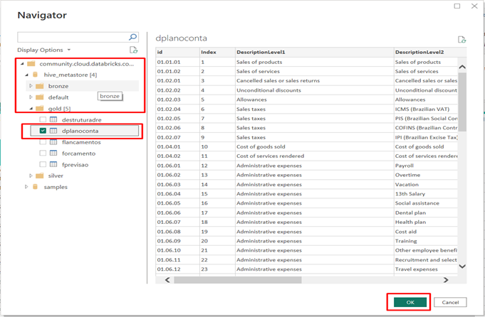

Finally, select the database and the table you want to import.

**Note:** In my case, since I only want to replace the data source from local SQL to Databricks, I will modify the table source via Power Query's advanced editor. To do this:

Go to the newly imported Databricks table and then open **Advanced Editor.**

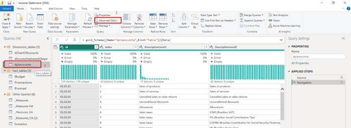

Copy the code from the editor and adapt it for each table based on its name:

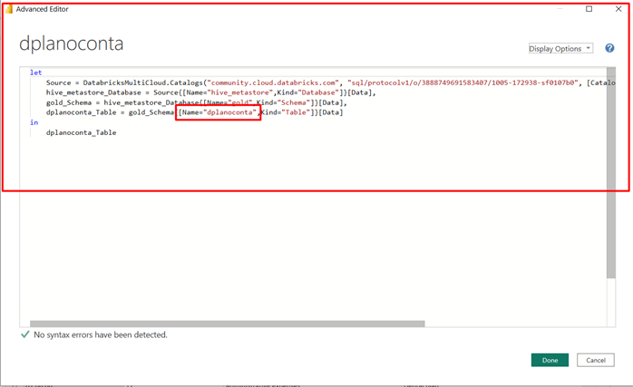

For example, in this case, I replaced the source for the table **destruturadre:**

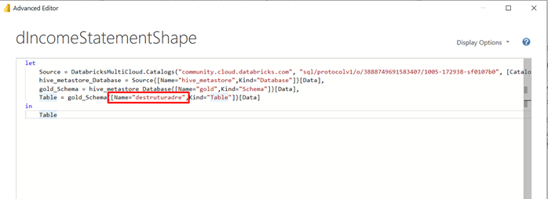

After this step, close and apply changes in Power Query, and the data will be loaded into the dashboard.

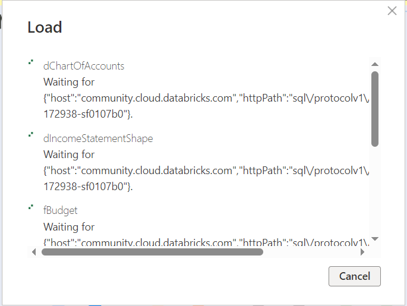

# Conclusion and Next Steps

This project demonstrated how **Databricks Community Edition** facilitates migrating local ETL to the cloud, organizing data into layers (Landing Zone, Bronze, Silver, and Gold) and optimizing the processing pipeline.

In the project, I plan to migrate the pipeline to Microsoft Azure, exploring tools such as **Azure Databricks** and **Azure Data Factory.**
