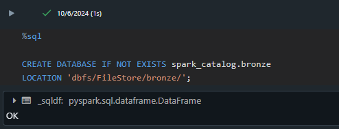
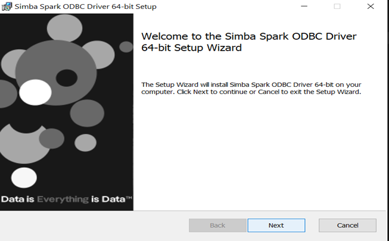
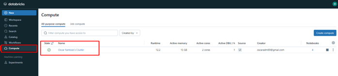
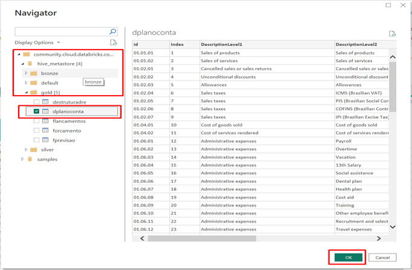
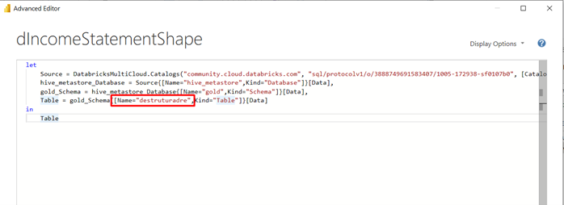

# Conteúdo

[Glossário](#glossário)

[Overview do Projeto](#overview-do-projeto)

[O que é databricks?](#o-que-é-databricks)

[Arquitetura](#arquitetura)

[Streaming ou Batch?](#streaming-ou-batch)

[Consumo de Dados](#consumo-de-dados)

[Etapas](#etapas)

[Etapa 1: Criando as camadas](#etapa-1-criando-as-camadas)

[Etapa 2: Carregando a camada bronze](#etapa-2-carregando-a-camada-bronze)

[Etapa 3: Tratando os dados e salvando na camada Silver](#etapa-3-tratando-os-dados-e-salvando-na-camada-silver)

[Etapa 4: Salvando os dados tratados na camada Gold](#etapa-4-salvando-os-dados-tratados-na-camada-gold)

[Etapa 5: Consumo dados no Power BI](#etapa-5-consumo-dados-no-power-bi)

[Conclusão e Próximos passos](#conclusão-e-próximos-passos)

# Glossário

| **Termo**                      | **Definição**                                                                                                                                          |
|---------------------------------|--------------------------------------------------------------------------------------------------------------------------------------------------------|
| **ACID**                       | Conjunto de regras que garantem que operações em um banco de dados sejam feitas corretamente e os dados fiquem consistentes (Atomicidade, Consistência, Isolamento, Durabilidade). |
| **Apache Spark**               | Ferramenta que processa grandes quantidades de dados de maneira rápida e distribuída, ou seja, em várias máquinas ao mesmo tempo.                      |
| **Batch Processing**           | Método de processar grandes quantidades de dados de uma vez só, em vez de analisar os dados conforme chegam.                                           |
| **Bronze Layer**               | Primeira camada de dados, onde os dados são armazenados no estado bruto, sem processamento. É como os dados chegam antes de serem limpos ou transformados. |
| **Data Lakehouse**             | Combinação de um **Data Lake** (que armazena grandes quantidades de dados) e um **Data Warehouse** (que organiza os dados para análise), oferecendo o melhor dos dois mundos. |
| **Databricks**                 | Plataforma de dados em nuvem que facilita o processamento de grandes volumes de dados usando o **Apache Spark**, além de ser usada para ciência de dados e análise. |
| **Databricks Community Edition** | Versão gratuita do Databricks, ideal para testes e aprendizado com o Spark e outras ferramentas, sem custos.                                          |
| **dbfs**                       | Sistema de arquivos do Databricks que organiza e armazena dados como se fosse um sistema de pastas no computador, mas na nuvem.                        |
| **Delta Lake**                 | Tecnologia que melhora o armazenamento de dados, garantindo que eles fiquem organizados, seguros e sempre atualizados corretamente, sem erros.        |
| **Gold Layer**                 | Última camada de dados, onde os dados já estão completamente processados, prontos para serem usados em relatórios e análises.                         |
| **Landing Zone**               | Área onde os dados são armazenados logo que chegam. Eles ainda não foram processados ou limpos, é a "primeira parada" dos dados antes de serem organizados. |
| **Medallion Architecture**     | Estrutura que organiza os dados em camadas (bronze, silver, gold), onde cada camada tem um nível de processamento e refinamento.                       |
| **/mnt**                       | Diretório no Databricks usado para conectar e acessar dados armazenados em serviços externos, como o Azure ou AWS, dentro do Databricks.              |
| **PySpark**                    | Versão do Spark que funciona com a linguagem de programação Python, facilitando o uso do Spark para quem já conhece Python.                           |
| **Silver Layer**               | Segunda camada de dados, onde os dados já foram limpos e organizados, prontos para análises mais detalhadas ou para serem usados em relatórios.       |
| **Streaming Processing**       | Método de processar dados em tempo real, ou seja, conforme os dados vão chegando, eles são analisados imediatamente.                                   |
| **Unity Catalog**              | Ferramenta do Databricks que ajuda a organizar, controlar e dar permissão para o acesso aos dados de maneira centralizada, facilitando a governança dos dados. |

# Overview do Projeto

No projeto anterior, foi automatizada a criação de uma DRE utilizando
Python e arquivos CSV. Com o aumento no volume de dados o pipeline foi
migrado para o **Databricks Community Edition**, garantindo
escalabilidade, automação e integração com bases de dados. Um dos
principais desafios do projeto foi traduzir os tratamentos realizados
anteriormente em Python puro para **PySpark** (linguagem na qual não
tenho muita familiaridade), embora similar ao Python em alguns aspectos.
Por outro lado, podia ter optado por realizar os tratamentos em **SQL**
com o qual tenho mais afinifade, no entanto preferi utilizar o pyspark
também para ganhar familiariade com a linguagem.

Mas vamos por partes: mais à frente, explicarei o que é o Databricks,
suas camadas, o porquê dele ser utilizado e quais problemas ele se
propõe a resolver.

**Como funciona**

1.  **Landing Zone**: Os dados brutos, como arquivos CSV, são
    armazenados diretamente nessa camada, sem alterações.

2.  **Camada Bronze**: Os dados da Landing Zone são transferidos e
    armazenados em formato Delta Lake, prontos para serem processados.

3.  **Camada Silver**: Nesta etapa, os dados são limpos e transformados,
    garantindo consistência e qualidade.

4.  **Camada Gold**: Os dados já tratados e refinados são organizados
    para consumo em relatórios e análises.

5.  **Consumo no Power BI**: O Power BI se conecta ao Databricks via
    ODBC/JDBC, permitindo o consumo direto das tabelas criadas.

# O que é databricks?

O **Databricks** é uma plataforma baseada em nuvem que facilita o
processamento e a análise de grandes quantidades de dados de maneira
rápida e eficiente. Ele combina a tecnologia do **Apache Spark** --- uma
ferramenta poderosa para processar dados em larga escala --- com um
ambiente colaborativo onde equipes podem desenvolver, compartilhar e
automatizar pipelines de dados, além de executar análises avançadas.

Com o Databricks, é possível organizar os dados em diferentes
\"camadas\", desde os dados brutos até os dados já processados e prontos
para serem usados em relatórios e dashboards. Ele é amplamente utilizado
para **ciência de dados**, **engenharia de dados** e **análise de
dados** em tempo real ou em grandes volumes.

Aqui estão algumas das principais vantagens de usar o Databricks:

-   **Escalabilidade**: Processa grandes volumes de dados distribuindo
    as tarefas entre várias máquinas.

-   **Colaboração**: Permite que equipes de dados trabalhem juntas em
    notebooks compartilhados.

-   **Automação**: Facilita a criação de fluxos automáticos para
    processar e transformar dados.

-   **Flexibilidade**: Funciona com diversas fontes de dados e pode ser
    integrado com outras ferramentas de BI e bases de dados.

# Arquitetura

**A arquitetura do projeto de migração da DRE para o Databricks segue o
conceito de arquitetura multi-hop com o uso do Delta Lake, dividida em
camadas de processamento de dados: Landing Zone, Bronze, Silver, e Gold.
Cada camada tem uma função específica no processamento e transformação
dos dados, garantindo que o fluxo seja eficiente e os dados estejam
sempre disponíveis em sua melhor forma para análise.**

1.  **Landing Zone:**

    -   **A Landing Zone é o ponto de entrada para os dados brutos, onde
        os arquivos CSV são carregados diretamente. Aqui, os dados
        chegam no formato original, sem qualquer tipo de transformação
        ou limpeza. Isso garante que o histórico completo dos dados seja
        mantido para reprocessamento ou auditoria futura.**

2.  **Camada Bronze:**

    -   **Na camada Bronze, os dados brutos da landing zone são movidos
        e armazenados no formato Delta Lake. Nesta etapa, os dados são
        integrados e preparados para o processo de transformação. Embora
        ainda estejam em seu estado bruto, eles já estão organizados em
        um formato mais adequado para processamento posterior.**

3.  **Camada Silver:**

    -   **Na camada Silver, os dados são limpos, transformados e
        padronizados. Nessa fase, os dados são filtrados e corrigidos,
        com remoção de inconsistências e ajuste de tipos de dados. Aqui,
        as tabelas começam a ser preparadas para análises mais
        detalhadas, garantindo que os dados estejam prontos para serem
        consumidos de forma consistente.**

4.  **Camada Gold:**

    -   **A camada Gold é onde os dados já estão prontos para consumo em
        nível de negócios. Esses dados são agregados e refinados para
        gerar insights mais profundos e análises em ferramentas de
        visualização, como o Power BI. Nessa camada, os dados são
        altamente otimizados para consultas rápidas e eficientes.**

# Streaming ou Batch?

**No processamento de dados, há duas abordagens principais que podem ser
utilizadas: batch e streaming. Cada uma possui vantagens específicas,
dependendo da natureza dos dados e da necessidade de processamento.**

**Processamento em Batch:**

**O batch é uma abordagem em que grandes volumes de dados são coletados
e processados em intervalos definidos, como diariamente, mensalmente ou
conforme necessário. Esse método é ideal quando os dados não precisam
ser analisados em tempo real e podem ser agrupados para processamento
posterior.**

-   **Aplicação no projeto: Para este projeto de DRE, a escolha será
    pelo processamento em batch. Os dados financeiros são extraídos em
    períodos definidos, como fechamentos mensais ou trimestrais, e não
    exigem resposta imediata. O batch permite consolidar esses dados
    periodicamente, garantindo eficiência no uso de recursos
    computacionais.**

-   **Vantagens: O batch facilita o processamento de grandes volumes de
    dados de uma vez só, com otimização do uso de recursos e sem a
    necessidade de processamento contínuo.**

**Processamento em Streaming:**

**Já o streaming envolve o processamento de dados em tempo real ou quase
em tempo real, assim que os dados são recebidos. Isso significa que o
sistema é capaz de responder continuamente às mudanças nos dados,
permitindo uma análise imediata.**

-   **Possibilidade futura: Embora o batch seja o método escolhido
    inicialmente, existe a possibilidade de expandir o projeto para
    streaming no futuro. Caso a empresa passe a receber dados
    financeiros diretamente de um banco de dados em tempo real, o
    streaming permitiria processar e analisar esses dados à medida que
    chegam, facilitando decisões instantâneas.**

-   **Vantagens: O streaming é ideal para situações em que é necessária
    uma resposta imediata, como em casos de monitoramento contínuo ou
    fluxos de transações financeiras em tempo real.**

# Consumo de Dados

**No projeto, mantemos o Power BI como a ferramenta principal para a
visualização e análise dos dados. A única mudança significativa foi a
fonte dos dados. Antes, os dados eram extraídos de um banco de dados
local, mas agora a fonte dos dados é o Databricks.**

**Os dados, após serem processados e refinados nas camadas bronze,
silver e gold, são conectados ao Power BI diretamente do Databricks.
Isso garante que as informações utilizadas nos relatórios e dashboards
estejam sempre atualizadas, sem depender de bancos de dados locais,
melhorando a performance e facilitando a escalabilidade.**

# Etapas

O projeto foi dividido em quatro etapas principais, que seguem o fluxo
das camadas **bronze**, **silver** e **gold** do Databricks. Primeiro,
foi criada a **estrutura das camadas**, onde os dados são organizados em
diferentes níveis de processamento. Depois, os dados foram carregados da
**landing zone** para a **camada bronze** (dados brutos), seguidos da
limpeza e transformação para a **camada silver** (dados organizados).
Por fim, os dados foram otimizados e agregados na **camada gold** para
uso em relatórios e análises. O processo foi modularizado em diferentes
notebooks, facilitando o gerenciamento e a execução de cada etapa
separadamente.

## Etapa 1: Criando as camadas

**Nesta etapa foram criada as camadas de landing zone, bronze, silver e
gold.**

**Criando landing zone:**

\# creating landing zone

**Criando camada bronze:**

**Criando camada silver:**

**Criando camada gold:**

## Etapa 2: Carregando a camada bronze

Neste etapa levo os dados brutos da landing zone para a camada bronze:

## 

# Etapa 3: Tratando os dados e salvando na camada Silver

Nesta etapa os dados da camada bronze foram tratados e salvos na camada
bronze. O notebook pode ser consultado neste link: [Loading Silver
Layer](https://databricks-prod-cloudfront.cloud.databricks.com/public/4027ec902e239c93eaaa8714f173bcfc/3888749691583407/84552440955705/6757744284100272/latest.html).

## Etapa 4: Salvando os dados tratados na camada Gold.

Nesta etapa os dados tratados foram levados para a camada Gold. Sendo
assim, os dados já estão prontos para consumo. O notebook pode ser
consultado neste link: [Loading Gold
Layer](https://databricks-prod-cloudfront.cloud.databricks.com/public/4027ec902e239c93eaaa8714f173bcfc/3888749691583407/4087602558815085/6757744284100272/latest.html)

## Etapa 5: Consumo dados no Power BI:

Como estou usando o Databricks Community Edition que não é integrado
diretamente ao Azure (conector do Power BI), vou me conectar usando
ODBC/JDBC. Primeiro passo é instalar o driver odbc no link: [odbc
driver](https://www.databricks.com/spark/odbc-drivers-download)

Se estiver tudo certo deverá aparecer entre os meus conectores o
Databricks conforme imagem abaixo:

Após clicar em Connect serão pedidos os seguintes campos abaixo:

**Server Hostname**

**HTTP Path**

Para pegar estas informações, vou na área de Compute no Databricks:

Clico no meu cluster ativo e na JDBC/ODBC encontrarei as credenciais:

Após copiar e colar as credencias terei acesso as minhas camadas criadas
no Databricks:

# 

Finalmente clico no banco de dados e na tabela que quero importar.

**Detalhe:** No meu caso, como quero apenas substituir a origem das
tabelas que antes eram no banco local SQL, vou alterar a fonte das
tabelas através do editor avançado do Power Query. Para isso:

Vou na tabela recém importada do Databricks e após isso em Advanced
Editor

# 

Após isso preciso copiar o código do editor e adaptar para cada nova
tabela conforme o seu nome:

Por exemplo neste caso alterei a fonte para a tabela **destruturadre:**

Após isto para fechar e aplicar normalmente o Power Query e os dados
serão levados para o Dashboard.

# Conclusão e Próximos passos

Este projeto mostrou como o **Databricks Community Edition** facilita a
migração de ETL local para a nuvem, organizando os dados em camadas
(Landing Zone, Bronze, Silver e Gold) e otimizando o processamento.

No próximo artigo, quero migraro pipeline para a cloud da Microsoft, a
**Azure**, onde pretendo explorar ferramentas como **Azure Databricks**
e **Azure Data Factory.**
